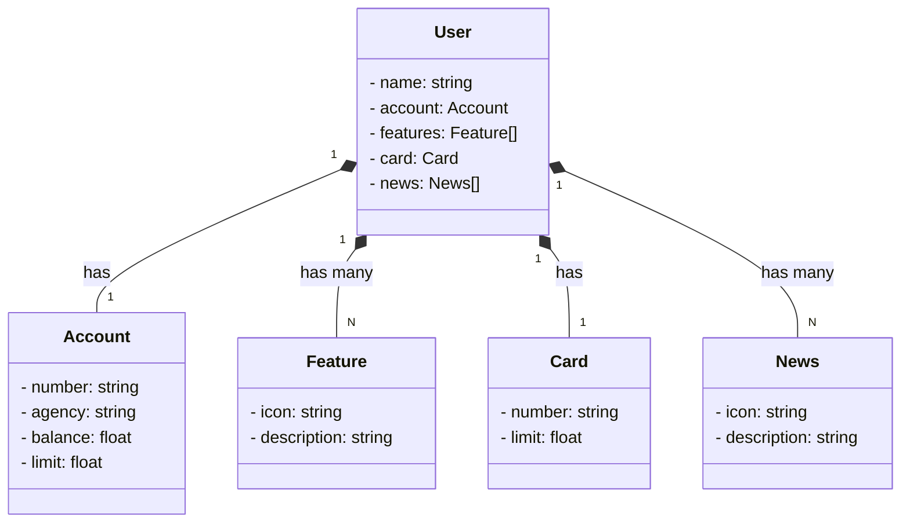

# Santander Dev Week 2023
Java RESTfull Api criada para a santander Dev Week. 

## Diagrama de Classes 

# Tecnologias Utilizadas

Neste projeto, estamos usando as seguintes tecnologias:

| Tecnologia         | Versão        | Finalidade                                                            |
|--------------------|---------------|-----------------------------------------------------------------------|
| Java              | 17 (LTS)      | Utilizado para desenvolvimento de aplicativos robustos em Java.     |
| Spring Boot       | 3             | Maximiza a produtividade do desenvolvedor com autoconfiguração.      |
| Spring Data JPA   | -             | Simplifica o acesso a dados e integração com bancos de dados SQL.   |
| OpenAPI (Swagger) | -             | Criação de documentação de API eficaz e fácil de entender.          |
| Railway            | -             | Facilita o deploy e monitoramento de soluções na nuvem, oferecendo diversos bancos de dados como serviço e pipelines de CI/CD. |
